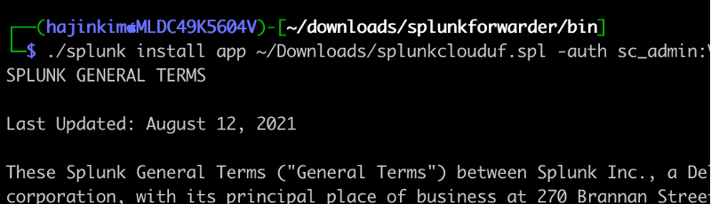
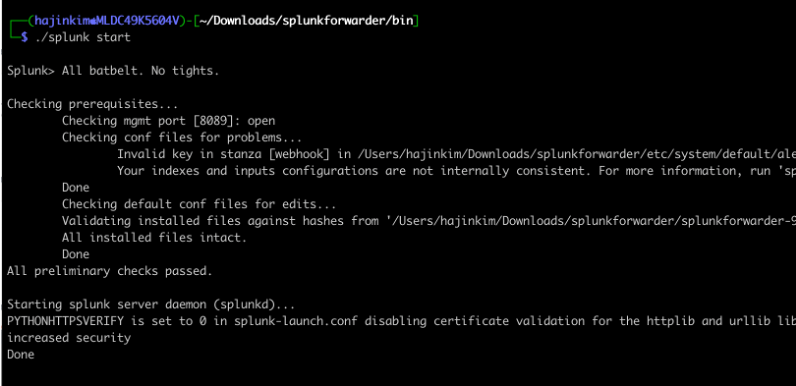
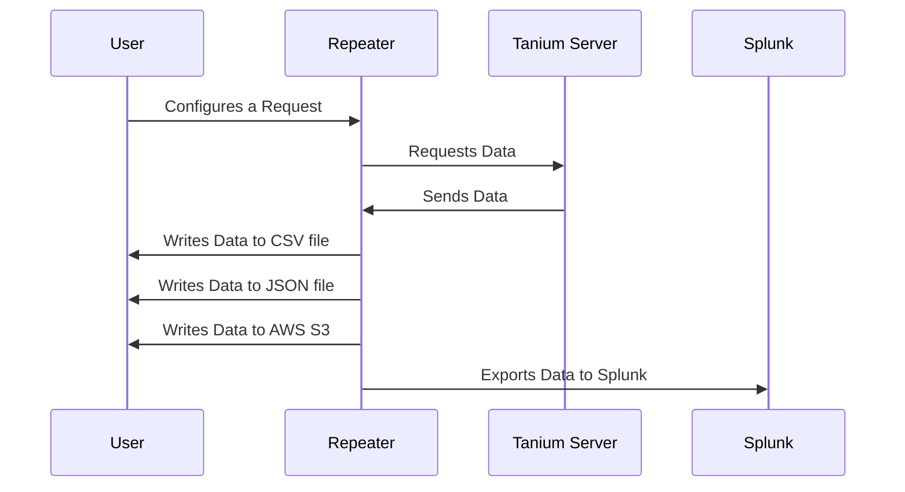

# Repeater

# Set Up
1. Install the dependencies
```
$ pip3 install -r requirements.txt
```
2. Create '.env' file
3. Inside the '.env' file, create the environment variables using the example below:
```
AWS_ACCESS_KEY_ID          = ""
AWS_SECRET_ACCESS_KEY      = ""
AWS_SESSION_TOKEN          = ""
splunk_token               = ""
splunk_server              = ""
tanium_token               = ""
tanium_server              = ""
```
4. Configure 'config.txt' via CSV file using the example below:
```
Name,Destination Type,File Location,Frequency,Last Run,Tanium Type,Component Name,File Format,Bucket Name,Flatten,Overwrite
```
5. Run Repeater
```
$ python3 Repeater.py
```


# Introduction

My name is Hajin Kim, and I am a recent graduate of Georgia Tech, where I completed my undergraduate degree in Computer Science. In the upcoming fall, I'll be starting on my Master's degree in the same field. This summer, I worked as an Enterprise Services Engineer intern under Joseph Langford. Apart from work, I like listening to music, traveling, coding, and drinking some good coffee!
# Problem Statement
Earlier, utilizing Tanium On-Prem on Connect, users had the ability to retrieve data and write it within the network. However, this functionality is no longer available. Nevertheless, our clients have expressed a specific demand for the data to be written within the network, as opposed to AWS S3.


# How I Solved It
In response, my mentor and I have developed a tailored solution to effectively address the demand. We created a comprehensive script that successfully implements all the functionalities requested by the client. Some of these features include data extraction from the Tanium Server, data extraction with filtering, and data exportation.


Using the script, users have the ability to configure a request that meets their requirements via a CSV file. Currently, our script is capable of extracting data like asset reports, asset views, and saved questions. Once the request has been made by the client, the Repeater collects the necessary data from the Tanium Server through a GET request, and the server then responds with the requested information to the Repeater. In alignment with the client's request, the data can be written in a CSV file, JSON file, AWS SW, or alternatively, exported to the Splunk Cloud instance. The user also has the ability to schedule the frequency at which the process runs.

## Splunk Integration
Alongside meeting the client's requests, I believed it would be beneficial to incorporate Splunk as an additional data export option in the project. This decision arose from my personal interest and the desire to gain proficiency in the domain. The approach I took involved setting up the Splunk Cloud instance, followed by the installation and configuration of the Universal Forwarder. Then, I utilized Splunk's HTTP Event Collector to facilitate the transmission of external data to the designated Splunk instance.


<p align="center">
  
</p>

<p align="center">
  
</p>


## Functionality Overview
1. Data Extraction from the Tanium Server
    - Asset Report
    - Asset View
    - Saved Question
2. Data Extraction with Filtering
3. Data Exportation
    - CSV file
    - JSON file
    - AWS S3
    - Splunk


## Sequence Diagram
Here is a visual representation of the Repeater script:




# Skills I Developed Along the Way
- Advanced Python Syntax
- Interacting with APIs and JSON 
- Algorithms
- Splunk Setup
- Splunk Integration
- Git Control Flow and Collaboration
- README and markdown design


# Conclusion 
I am incredibly grateful for the opportunity to have been a part of this significant project during my time at Tanium. It has been an incredible journey of personal and technical growth. I want to sincerely thank Joseph for his guidance and to everyone who generously shared their time and expertise to help me navigate challenges and questions. I am excited to apply the lessons learned as I continue to progress and innovate in my future pursuits. In closing, thank you again to the entire Tanium team for fostering an environment that encourages growth, learning, and innovation.
